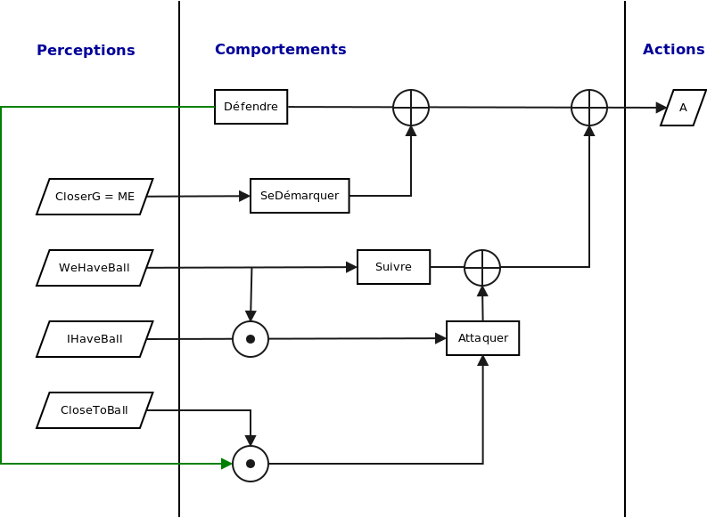
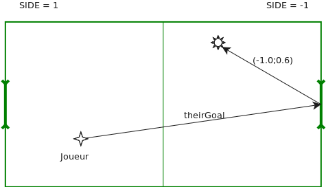
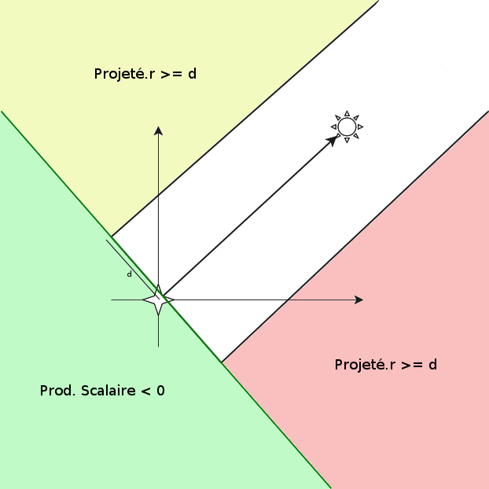

# Team Daller pour Soccerbots

Module Intelligence artificielle distribuée
Université de Caen Normandie
Évariste Daller
M1 Informatique 2015-2016

Stratégie d'une équipe de robots footballeurs pour la simulation _Soccerbots_ de Teambots [https://www.cs.cmu.edu/~trb/TeamBots/](https://www.cs.cmu.edu/~trb/TeamBots/).

## Description de la stratégie

Le programme s'articule autour d'une architecture de subsomption. Chaque joueur adopte
une attitude en fonction de ses perceptions propres de l'environnement. Nous n'avons pas mis en
place de système de communication.

## Environnement

Nous explicitons ici l'ensemble des connaissances de l'environnement prises en comptes par
les joueurs de l'équipe.

### Repérage dans l'espace

Le joueur connaı̂t sa position, la position de ses coéquipiers ainsi que celle de ses opposants.
Il garde aussi en mémoire la position de la balle, du but adverse et de son but.

Ces informations permettront de mettre à jour des perceptions booléennes à l'origine d'actions ou de comportements. Elle permettront aussi de coordonner les actions du joueur, pour réaliser une stratégie cohérente.

Le repérage des objets se fait de deux manières, en manipulant la classe `Vec2` :

* En vue subjective : avec `Vec2.t` et `Vec2.r` en repérage polaire (le centre étant le joueur)
* De manière globale, en coordonnées cartésiennes avec `Vec2.x` et `Vec2.y`

Dans la majorité des cas, le repérage polaire subjectif est utilisé.

### Identification

Le joueur connaı̂t son numéro, ce qui permet de désigner un gardien de but d'office. En effet, le gardien est le seul comportement qui n'est pas pris en compte dans l'architecture. En connaissant l'emplacement de son but, le joueur déduit de quel côté il joue. Ceci permet de mettre en place un coefficient side égal à 1 ou −1 suivant de quel côté on joue, qui sera utilisé
dans les calculs pour garder une symétrie.

### Stratégie

Nous avons adopté une architecture de subsomption, les comportements étant activés par des perceptions. Pour organiser ces comportements, nous avons deux mécanismes :

* l'inhibition : chaque comportement détient une liste de comportements à inhiber, et lorsqu'un comportement est actif, il désactive (inhibe) les comportements de cette liste
* la surveillance : un comportement peut en déclencher un autre sous certaines conditions lors de son activation.

Les perceptions sont des booléens calculés à chaque pas de temps, en fonction de l'environnement connu. Ensuite, les comportements sont activés si l'ensemble de leurs perceptions requises sont vraie.

### Perceptions

Il y a cinq perceptions différentes stockées dans une `HashMap` :

* `WeHaveBall` : Le joueur le plus près de la balle est de notre équipe
* `IHaveBall` : Je suis le joueur le plus près de la balle
* `CloserToTheirGoal` : Je suis le joueur le plus près du but adverse dans mon équipe
* `CloseToBall` : La balle est relativement proche de moi
* `Demarque` : Je suis démarqué (au dernier pas de temps)

Les deux premières sont déduites du résultat de la méthode `whoHasBall`, les deux suivantes
étant mises à jour par comparaison de distances.
`Demarque` est liée intrinsèquement au fonctionnement du comportement associé `Se Démarquer`. En effet, cette perception sert de flag pouvant bloquer ce comportement pour son bon fonctionnement.

### Comportements

Les quatre différents comportements sont :
* `Défendre` : comportement par défaut, lorsque l'autre équipe a la balle
* `Se Démarquer` : lorsqu'on défend et qu'on est le plus proche dans l'équipe du but adverse
* `Suivre` : quand quelqu'un de notre équipe a la balle
* `Attaquer` : quand j'ai la balle, ou que je défend et que la balle s'approche

#### Défendre

Un défenseur va en position défensive s'il ne l'est pas déjà, et suit la balle sans bouger sinon.
Lorsque la balle est assez proche, il attaque (surveillance).
On considère comme position défensive valable les points du demi-disque centré en notre
but, de rayon la distance que l'on utilise pour tirer lorsque nous attaquons. Les joueurs défenseurs iront vers leur but, jusqu'à être dans cette zone.
Pour répartir les joueurs en défense, et éviter qu'ils ne s'aglutinent, on utilise un champ de
répulsion entre joueurs, dont le coefficient de répulsion est inversement proportionnel au 
carré de la distance les séparant.

#### Se démarquer

Un joueur qui doit se démarquer va se placer en position d'attaque, et y reste en fixant la
balle, jusqu'à ce que :

* la balle le dépasse
* ou que le joueur ne soit plus le plus proche du but adverse

Le joueur démarqué a pour rôle d'être en mesure de réceptionner une passe d'un autre joueur
(attaquant), et de tenir une position avancée prévoyant un éventuel retour en zone de l'opposant.

#### Attaquer

Il y a deux cas de figures pour être attaquant :

* être le joueur le plus proche de la balle des deux équipes
* être en défense, mais que la balle soit près de nous

Dans le premier cas, le joueur reste attaquant tant qu'il garde la balle. S'il la perd, il sera
sûrement suffisamment près d'elle dans la foulée pour passer dans le deuxième cas. Dans ce second
cas, le joueur adopte un comportement d'attaquant, mais si c'est un autre joueur de son équipe qui arrive à la balle avant lui, alors il deviendra suiveur (car il n'aura plus de raison d'être défenseur, et ce n'est pas lui qui a la balle).

Le comportement de l'attaquant est

* de se diriger progressivement vers le but adverse, en emportant la balle devant lui
* ou de se diriger vers un point en avant d'un joueur qu'il juge démarqué, avec la balle
* tirer lorsqu'il est assez proche du but, ou du point visé

Comme il n'y a pas de système de communication le joueur ne connaı̂t pas le comportement
de ses coéquipiers. En outre, il est plus intéressant de reconnaı̂tre un joueur comme démarqué dans les faits : suffisamment isolé pour qu'on puisse lui faire une passe.

Un joueur `j` est considéré démarqué si entre lui et nous, il y a un couloir d'une largeur
donnée, qui ne contient aucun opposant (voir figure ci-dessous).

Pour vérifier si un joueur est présent dans ce couloir, on cherche un opposant `op` vérifiant :

* `op` est situé dans la direction de `j` (produit scalaire positif)
* le projeté orthogonal de `op` sur la droite orthogonale à `j` passant par moi, est assez proche (dans le couloir)

Si un opposant vérifiant ces conditions existe, `j` n'est pas réputé démarqué.

### Résultats

Nous avons obtenu les résultats suivants avec les équipes fournies. Les scores sont affichés
dans le même ordre que la disposition des équipes sur le terrain.

| Équipe 1  | Équipe 2  | Scores |
|-----------|-----------|--------|
| Daller    | BasicTeam | 15 - 1 |
| Daller    | BrianTeam | 5 - 0  |
| Daller    | DTeam     | 1 - 0  |
| BasicTeam | Daller    | 0 - 20 |
| BrianTeam | Daller    | 0 - 3  |
| DTeam     | Daller    | 5 - 1  |

### Améliorations

Une première amélioration serait de mettre en place un système d'évitement de collisions
entre les joueurs, car ces dernières amènent beaucoup de blocages du jeu. On peut s'inspirer de ce qui a été fait pour le comportement `Se Démarquer`, en utilisant des champs de répulsion.

Enfin, étant donné la taille du terrain et la rapidité de jeu, le joueur démarqué ne reçoit pas beaucoup de passes, et il faudrait revoir ce système pour faire circuler la balle plus efficacement.

